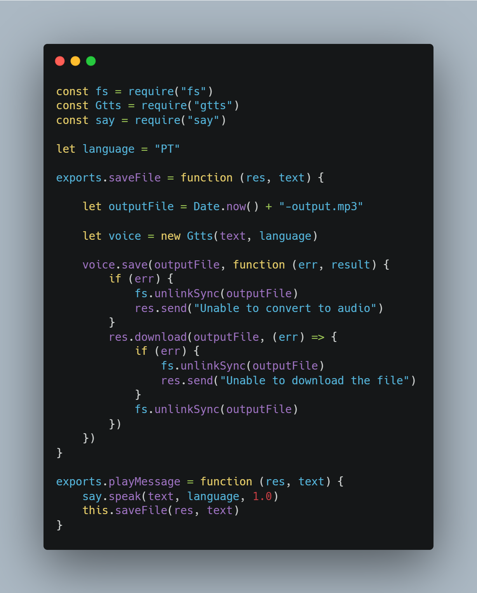

# Text to speech for Node.js

<a href="https://opensource.org/licenses/MIT">
  
</a>
<a href="https://nodejs.org/en/">
  
</a>

> Text to speech for Node.js - A small Node.js library that provides a text to speech conversion.



## Install

```
$ npm install
```

## Usage

In Terminal, `type it.`

```js
$ npm start
```

Open your browser and type it http://localhost:3000